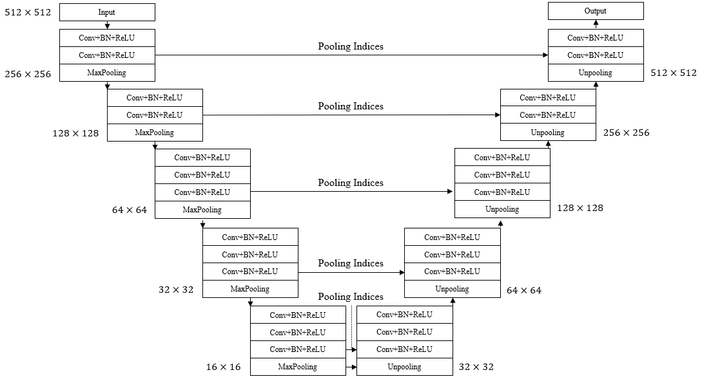

# Implementation of SegNet using PyTorch Deep Learning Framework
 
The architecture was inspired by Segnet: A deep convolutional encoder-decoder architecture for image segmentation. 

## Overview
This repository contains an unofficial implementation of SegNet using PyTorch.<br/>
Please refer to the paper at the following page: 
[Segnet: A deep convolutional encoder-decoder architecture for image segmentation](https://ieeexplore.ieee.org/abstract/document/7803544/ "Visit")

## Model

## Paper
If you use this software for your research, please cite:

```bibtex
@article{badrinarayanan2017segnet,
  title={Segnet: A deep convolutional encoder-decoder architecture for image segmentation},
  author={Badrinarayanan, Vijay and Kendall, Alex and Cipolla, Roberto},
  journal={IEEE transactions on pattern analysis and machine intelligence},
  volume={39},
  number={12},
  pages={2481--2495},
  year={2017},
  publisher={IEEE}
}
```

## License
This program is available for download for non-commercial use, licensed under the GNU General Public License. This allows its use for research purposes or other free software projects but does not allow its incorporation into any type of commercial software.

## Files
The repository contains the following files:

- `model.py`: Python script file, containing the PyTorch implementation of the SegNet.
- `README.md`: Markdown file explaining the model source code.
